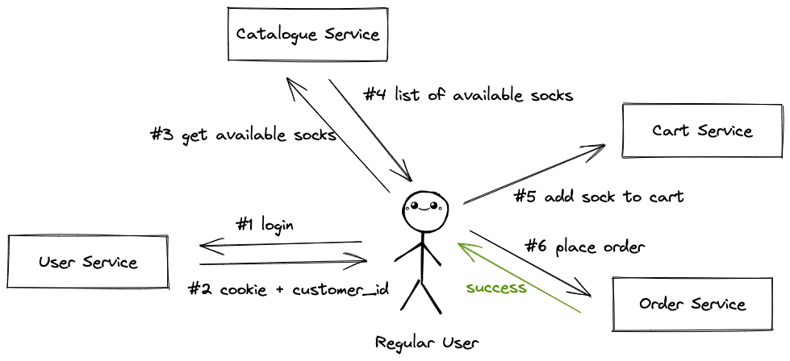

# Target System
## Sock Shop
Sock Shop simulates the user-facing part of an e-commerce website that sells socks. It is intended to aid the demonstration and testing of microservice and cloud native technologies. Sock Shop is maintained by Weaveworks and Container Solutions. Documentation for sock shop is available at https://microservices-demo.github.io/. Full source code for microservice demo is accessible at https://github.com/microservices-demo.

## Architecture

The architecture of the demo microservices application was intentionally designed to provide as many microservices as possible.

Furthermore, it is intentionally polyglot to exercise several different technologies. As seen in the image above, the microservices are roughly defined by the function in an ECommerce site.

All services communicate using REST over HTTP. Their API specifications are provided as OpenAPI specs in `public/api-specs` folder.

# Testing Strategy
## Context
Most real-world applications are composed of multiple microservices that interact with each other to provide the full functionality of an application. In an enterprise, there will be a dedicated team working on each microservice. Only architects and a few senior developers have a complete vision of the application and its flow. Without UI in place, it is difficult to judge if all the microservices will work cohesively to provide the features architects have envisioned.

## Approach
**Goal**: Demonstrate **real-world** e2e testing of complex applications built using microservice architecture.

We wrote integration tests using **Postman** which simulate the flow UI will take when it is developed. We chain together multiple requests for different services and validate if the system behaves as expected or not.

This repo demonstrates how e2e tests for microservices can help find bugs in overall flow without UI in place.


## Tools/Libraries Used
- **Minikube** - For running local k8s cluster, optional if deploying to public cloud
- **Kubectl** - For k8s cluster management
- **Node.js** - For using `newman` package for automation and regression testing
- **Postman** - For test development

## Test Environment
Full setup with all microservices can be run in any public cloud infrastructure. For local testing, you can use a local **k8s** cluster with **minikube** or **docker-compose**. Please refer to the local setup instructions at the end to find more details.

## Specific Testing setup
Since Sock Shop is a cloud-native application, we can run it on a wide variety of platforms. The following setup was used by us during test development:
- **Shubham** - Linux + Podman + Minikube + Weave in K8s
- **Sayak** - Windows + Docker + Docker Compose + Local Weave


## Tested Scenarios
**Scenario 1:** An existing user with a proper shipping address, payment card details and a non-empty cart can place an order successfully.

**Why?** - This is the core functionality of the sock shop.

___

**Scenario 2:** A login attempt from a non-existent user fails and new users can register themselves.

**Why?** - To prevent malicious login attempts and allow onboarding of new users.

___

**Scenario 3:** Card payments are declined and order isn't placed when items worth more than **100$** are added to the cart.

**Why?** Shows an unrealistic purchase for a small commodity like a sock.

___

**Scenario 4:** Order cannot be placed when the shipping address or card information is missing.

**Why?** Sock shop cannot process orders with incomplete information.

___

**Scenario 5:** Order cannot be placed with an empty cart.

**Why?** Accepting an order without any items doesn't make any sense. What should we ship to the user?


## Bugs Uncovered
- `GET /orders` should return a list of all orders with status code `OK - 200`, but was returning `CREATED - 201`.

## Advantages
- **Technology Agnostic** - These tests are independent of the underlying technology. In our example, different programming languages, databases and frameworks are used across different microservices.
- **UI independence** - Backend development teams don't need to wait for front-end developers to complete their development for testing end-to-end flows.
- **Smoke Tests** - These tests can reveal simple failures in interaction between microservices that block a particular scenario.
- **Minimal Entry Barrier** - Since, these are black box tests, even a new developer can start creating these tests. The focus is more on the interaction between microservices rather than the internal workings of microservices.
- **Realistic** - These tests are more realistic compared to integration tests with mocked services.
- **Load Testing Foundation** - These tests can provide a basic skeleton for load testing. We can configure the number of iterations to convert these e2e tests to performance/load tests.
- **Test Maintenance** - Postman is very developer-friendly and can be used to maintain these tests.
- **CI/CD Integration** - Newman allows running tests from CI/CD pipelines.

## Disadvantages
- **Resource Intensive** - These tests require a test instance of all the microservices running on which tests can be executed. It is easy for big companies to provision dedicated resources for testing, but startups will struggle.
- **Blackbox** - These tests don't help us find bugs within a microservice. These tests should be used alongside existing **unit** and **integration** tests.
- **Licensing** - Features like advanced reporting and analytics are hidden behind the paywall for Postman under their pricing model.
- **Version Control Issue** - The JSON file for test collections is difficult to read and even small changes in Postman create a big difference in the new version. Thus, making it difficult to track changes in version control systems like git.
- **Limited to RESTful APIs** - Postman's primary focus is to support RESTful service, but there are cases where microservices may prefer other modes of communication like Websockets, RPC, protocol buffers, AMQP, etc. Testing with these channels won't be feasible using Postman.
- **Lack of Native Performance Testing** - Postman usually requires integration with a third-party tool to provide performance testing.

# Local Setup in Kubernetes with Minikube
```
# Start minikube with 4GB RAM and 4 CPU cores
minikube start --memory 4096 --cpus 4
# Deploy microservices demo to minikube k8s cluster
kubectl create -f microservices-demo-k8s.yaml
# Wait for deployment to complete
kubectl get pods -n "sock-shop" --watch
# Setup weavescope
kubectl apply -f https://github.com/weaveworks/scope/releases/download/v1.13.2/k8s-scope.yaml
# Port forward weavescope
kubectl port-forward -n weave "$(kubectl get -n weave pod --selector=weave-scope-component=app -o jsonpath='{.items..metadata.name}')" 4040
# Tunnel clusterIP for local accessibility
minikube tunnel --cleanup
# Install all dependencies to run test
npm install
# Run tests
npm test

# Cleanup steps
minikube stop
minikube delete
```

# Local Setup in Docker
```
# Start, -d frees terminal by running in deattached mode
docker-compose -f microservices-demo-docker.yml up -d
# Run without -d flag to see live logs

# Cleanup steps
docker-compose -f microservices-demo-docker.yml down
```

# Optional
Setup weavescope for cluster visualization. Follow specific section for k8s or docker based on your setup.
https://www.weave.works/oss/scope/

# Exploring API Specs and Test Reports
Run `npm start` to start the application. It hosts OpenAPI specs for all microservices
using Swagger. Test reports are generated in `public/reports` directory. Test reports for the last run are also accessible at `http://localhost:4004/reports/<collection_name>.html`


# Contributors
- **Shubham** - PH2022508
- **Sayak Chowdhury** - MS2023012

# Repo Source
https://github.com/prophet1906/e2e-testing
