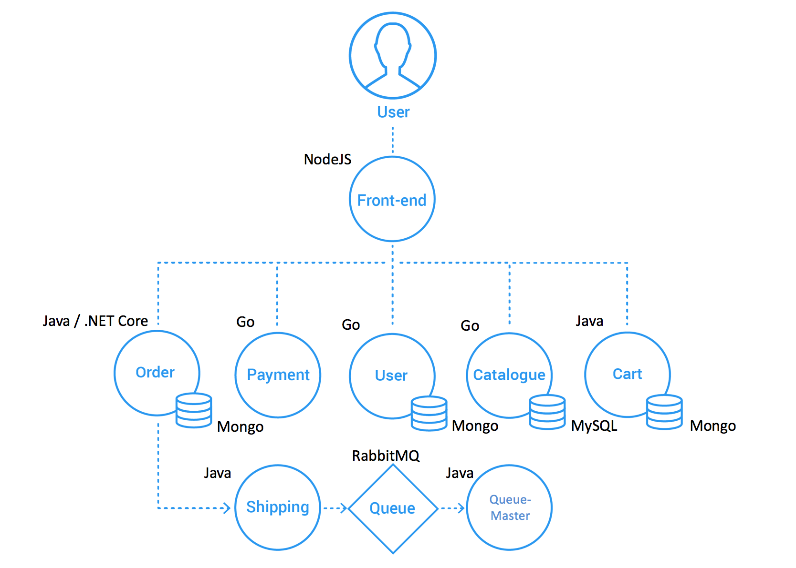

# Target System
## Sock Shop
Sock Shop simulates the user-facing part of an e-commerce website that sells socks. It is intended to aid the demonstration and testing of microservice and cloud native technologies. Sock Shop is maintained by Weaveworks and Container Solutions. Documentation for sock shop is available at https://microservices-demo.github.io/. Full source code for microservice demo is accessible at https://github.com/microservices-demo.
## Architecture


# Pre-requisites
- **Minikube** - For running local k8s cluster, optional if deploying to public cloud
- **Kubectl** - For k8s cluster management
- **Node.js** - For using `newman` package for automation and regression testing
- **Postman** - For test development

# Local Setup in Kubernetes with Minikube
```
# Start minikube with 4GB RAM and 4 CPU cores
minikube start --memory 4096 --cpus 4
# Deploy microservices demo to minikube k8s cluster
kubectl create -f microservices-demo-k8s.yaml
# Wait for deployment to complete
kubectl get pods -n "sock-shop" --watch
# Setup weavescope
kubectl apply -f https://github.com/weaveworks/scope/releases/download/v1.13.2/k8s-scope.yaml
# Port forward weavescope
kubectl port-forward -n weave "$(kubectl get -n weave pod --selector=weave-scope-component=app -o jsonpath='{.items..metadata.name}')" 4040
# Tunnel clusterIP for local accessibility
minikube tunnel --cleanup
# Install all dependencies to run test
npm install
# Run tests
npm test

# Cleanup steps
minikube stop
minikube delete
```

# Local Setup in Docker
```
# Start, -d frees terminal by running in deattached mode
docker-compose -f microservices-demo-docker.yml up -d
# Run without -d flag to see live logs

# Cleanup steps
docker-compose -f microservices-demo-docker.yml down
```

# Optional
Setup weavescope for cluster visualization. Follow specific section for k8s or docker based on your setup.
https://www.weave.works/oss/scope/

# Exploring API Specs and Test Reports
Run `npm start` to start the application. It hosts OpenAPI specs for all microservices
using swagger. Test reports are generated at `public/report.html`. Test report for last run is also accessible at http://localhost:4004/report.html

# Application Architecture
TODO: Add diagram and write basic information about architecture of microservices demo

# Tested Flows
TODO: Add diagrams for all the tested flows with name

# Advantages of our approach
TODO: List characteristics which make this approach useful

# Disadvantages of our approach
TODO: List characteristics which make this approach infeasible

# Why we went with this approach?
TODO: Add concrete reasons why we picked this approach over others

# Contributors
TODO: Add mail/contact info

# Test Scenarios
1. Existing Users can place an order successfully.
2. User Login fails for non-existent user, New user can register and login.
3. Payment is declined when order value is above 100$ and order isn't placed.
4. Order cannot be placed when shipping address or card information is missing.
5. Order cannot be placed with empty cart.